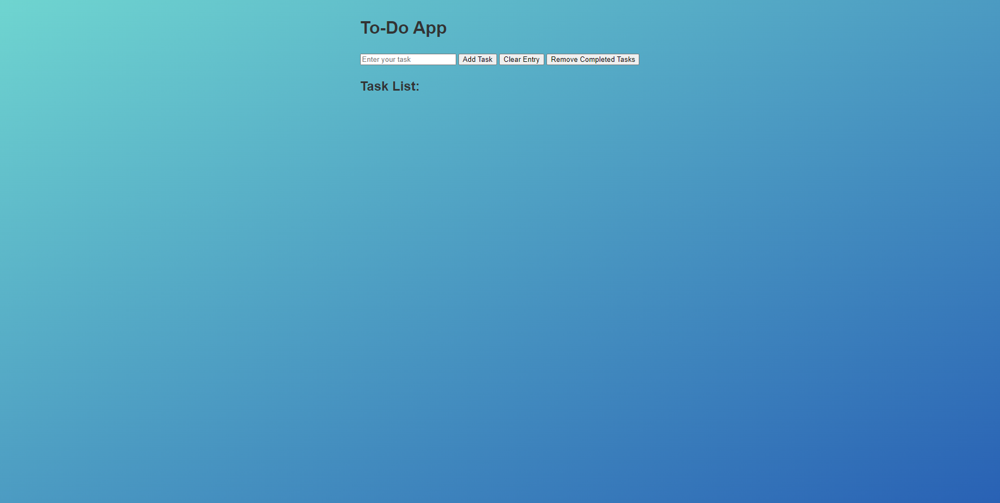

# To Do App

## To do app using HTML, CSS and JavaScript.  

click [here]( https://saeed7865.github.io/rock-paper-scissors/) to view.

### Summary
This is a simple project Using the three basic languages of front end development HTML,CSS and JavaScript. One of the techniques used in this project was
the manipulating of HTML with the use of Javascript.
In this app the user can make a list of things that they need to do and after completing those task they can clear that list and make a new one. A great app
for everyday organization.
### Author
- Osama Saeed Sandhu - Full stack developer - [Website]|[Linkedin]